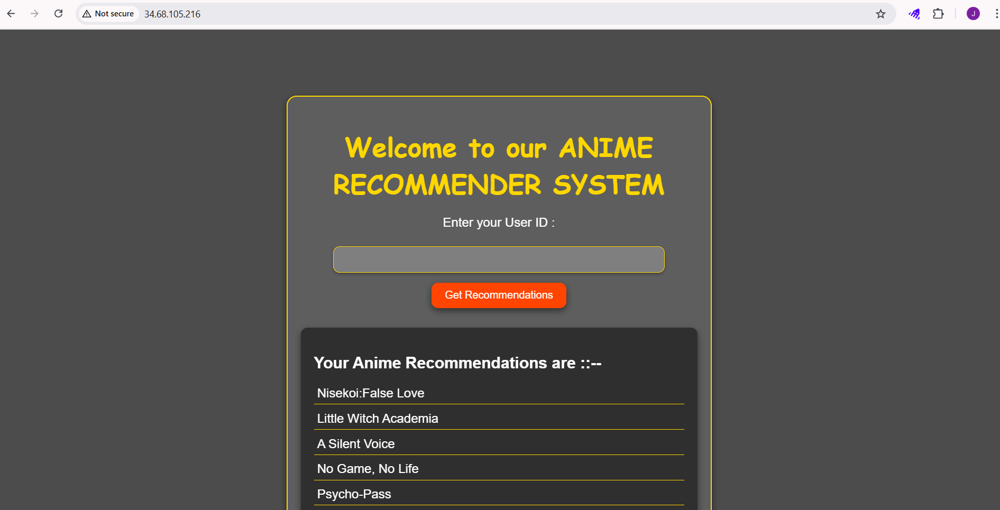

# CI/CD Pipeline with Jenkins, Docker, and Kubernetes

This project demonstrates a complete CI/CD workflow to automate the building, containerization, and deployment of a Python-based ML application to **Google Cloud Run** using **Jenkins**, **Docker**, and **Google Cloud Registry (GCR)**, **(GKE)**.

---

## 🚀 Workflow Overview

1. **Create a VM** in Google Cloud (Compute Engine: `e2-standard`, Ubuntu OS).
2. **Integrate GitHub** with Jenkins.
3. **Write Jenkins Pipeline** for automated build and deployment.
4. **Build Docker Image** of the project.
5. **Push Image to GCR** (Google Container Registry).
6. **Deploy App** from GCR to Kubernetes.

---

## 🖥️ 1. Create VM in Google Cloud

- Machine type: `e2-standard`
- OS: **Ubuntu**
- Networking: Allow Http
- Allow Access to all API
- SSH into the VM once created.


---

## ⚙️ 2. Install Jenkins

Follow the official Jenkins installation guide for Ubuntu:  
[Install Jenkins on Ubuntu](https://phoenixnap.com/kb/install-jenkins-ubuntu)

- Open port 8080 from network firewall, make sure to give access to all instance
- Copy external IP address for VM:8080 in browser
- Copy password from /var with sudo in front of it and paste
- install all suggested plugins

---

## 🐳 3. Install Docker

Official Docker installation guide for Ubuntu:  
[Install Docker on Ubuntu](https://docs.docker.com/engine/install/ubuntu/)

---

## 🔑 4. Grant Docker Permissions to Jenkins User

```bash
sudo su
groupadd docker
usermod -aG docker jenkins
usermod -aG root jenkins
sudo systemctl restart jenkins

## 🐍 5. Install Python & Dependencies Inside VM

```bash
sudo su
apt update -y
apt install -y python3
python3 --version
ln -s /usr/bin/python3 /usr/bin/python
python --version
apt install -y python3-pip
apt install -y python3-venv
```

---

## 📄 6. Initial Jenkinsfile (GitHub Clone)

```groovy
pipeline {
    agent any

    stages {
        stage('Cloning Github repo to Jenkins') {
            steps {
                script {
                    echo 'Cloning Github repo to Jenkins............'
                    checkout scmGit(
                        branches: [[name: '*/main']],
                        extensions: [],
                        userRemoteConfigs: [[
                            credentialsId: 'github-token',
                            url: 'https://github.com/Joelfernandes30/mlops-project-1.git'
                        ]]
                    )
                }
            }
        }
    }
}
```

---

## 📦 7. Dockerfile

```dockerfile
FROM python:3.8-slim

# Set environment variables to prevent Python from writing .pyc files & Ensure Python output is not buffered
ENV PYTHONDONTWRITEBYTECODE=1 \
    PYTHONUNBUFFERED=1

# Install system dependencies required by TensorFlow
RUN apt-get update && apt-get install -y \
    build-essential \
    libatlas-base-dev \
    libhdf5-dev \
    libprotobuf-dev \
    protobuf-compiler \
    python3-dev \
    && apt-get clean \
    && rm -rf /var/lib/apt/lists/*

# Set the working directory
WORKDIR /app

# Copy the application code
COPY . .

# Install dependencies from requirements.txt
RUN pip install --no-cache-dir -e .

# Train the model before running the application
RUN python pipeline/training_pipeline.py

# Expose the port that Flask will run on
EXPOSE 5000

# Command to run the app
CMD ["python", "application.py"]


```

---

## ⚙️ 8. Updated Jenkinsfile (with Python Env Setup)

```groovy
pipeline {
    agent any

    environment {
        VENV_DIR = 'venv'
    }

    stages {
        stage('Cloning Github repo to Jenkins') {
            steps {
                script {
                    echo 'Cloning Github repo to Jenkins............'
                    checkout scmGit(
                        branches: [[name: '*/main']],
                        extensions: [],
                        userRemoteConfigs: [[
                            credentialsId: 'github-token',
                            url: 'https://github.com/Joelfernandes30/anime-recommendationproject.git' //Add your url
                        ]]
                    )
                }
            }
        }

        stage('Setting up Virtual Environment & Installing Dependencies') {
            steps {
                script {
                    echo 'Setting up Virtual Environment & Installing Dependencies............'
                    sh '''
                    python -m venv ${VENV_DIR}
                    . ${VENV_DIR}/bin/activate
                    pip install --upgrade pip
                    pip install -e .
                    '''
                }
            }
        }
    }
}
```

---

## ☁️ 9. Install Google Cloud SDK

```bash
apt-get update
apt-get install -y curl apt-transport-https ca-certificates gnupg
curl https://packages.cloud.google.com/apt/doc/apt-key.gpg | apt-key add -
echo "deb https://packages.cloud.google.com/apt cloud-sdk main" \
    | tee -a /etc/apt/sources.list.d/google-cloud-sdk.list
apt-get update && apt-get install -y google-cloud-sdk
gcloud --version
```

Restart Jenkins:

```bash
sudo systemctl restart jenkins
```

---

## 🔐 10. Add GCP Credentials to Jenkins

* Go to **Jenkins → Manage Jenkins → Credentials → Global Credentials**.
* Add a **Secret File** credential.
* Upload your GCP Service Account JSON file.
* Name it: `gcp-key`.

---

## 🔓 11. Enable Required Google Cloud APIs

Enable in Google Cloud Console:

1. **Google Container Registry API**
2. **Artifact Registry API**
3. **Cloud Resource Manager API**
4. **Kubernetes Engine API**

Assign **Owner** role to your service account in **IAM**.

---

## 12. Create deployment.yaml file
```
apiVersion: apps/v1
kind: Deployment
metadata:
  name: ml-app
spec:
  replicas: 2
  selector:
    matchLabels:
      app: ml-app
  template:
    metadata:
      labels:
        app: ml-app
    spec:
      containers:
      - name: ml-app-container
        image: gcr.io/probable-bebop-471914-q2/ml-project:latest # your project name
        ports:
        - containerPort: 5000  # Replace with the port your app listens on
---
apiVersion: v1
kind: Service
metadata:
  name: ml-app-service
spec:
  type: LoadBalancer
  selector:
    app: ml-app
  ports:
  - protocol: TCP
    port: 80
    targetPort: 5000
```
## 13. Git Push all the files to github

## 🌐 14. Deploy to Kubernetes

* Open **Google Kubernetes Engine** → **GKE**.
* Create a cluster and name is **ml-app**.
* click on DNS allow access.
* review and create (wait for it to create)

---

## 13. Install Kubectl in VM machine
```
# Update packages
sudo apt-get update
sudo apt-get install -y apt-transport-https ca-certificates curl

# Add the Kubernetes apt repo GPG key
sudo curl -fsSL https://pkgs.k8s.io/core:/stable:/v1.30/deb/Release.key | sudo gpg --dearmor -o /etc/apt/trusted.gpg.d/kubernetes.gpg

# Add the Kubernetes apt repo
echo "deb [signed-by=/etc/apt/trusted.gpg.d/kubernetes.gpg] https://pkgs.k8s.io/core:/stable:/v1.30/deb/ /" | sudo tee /etc/apt/sources.list.d/kubernetes.list

# Update and install kubectl
sudo apt-get update
sudo apt-get install -y kubectl


sudo apt-get update && sudo apt-get install -y apt-transport-https ca-certificates gnupg curl
echo "deb [signed-by=/usr/share/keyrings/cloud.google.gpg] https://packages.cloud.google.com/apt cloud-sdk main" | sudo tee -a /etc/apt/sources.list.d/google-cloud-sdk.list
curl https://packages.cloud.google.com/apt/doc/apt-key.gpg | sudo gpg --dearmor -o /usr/share/keyrings/cloud.google.gpg


sudo apt-get update && sudo apt-get install -y google-cloud-sdk-gke-gcloud-auth-plugin


export USE_GKE_GCLOUD_AUTH_PLUGIN=True
echo 'export USE_GKE_GCLOUD_AUTH_PLUGIN=True' >> ~/.bashrc


```


## 📜 13. Final Jenkinsfile (Build & Push to GCR and deploy to GKE)

```
pipeline {
    agent any

    environment {
        VENV_DIR = 'venv'
        GCP_PROJECT = 'probable-bebop-471914-q2'  //your project name
        GCLOUD_PATH = "/var/jenkins_home/google-cloud-sdk/bin"
        
    }

    stages{

        stage("Cloning from Github...."){
            steps{
                script{
                    echo 'Cloning from Github...'
                    checkout scmGit(branches: [[name: '*/main']], extensions: [], userRemoteConfigs: [[credentialsId: 'github-token', url: 'https://github.com/Joelfernandes30/anime-recommendationproject.git']]) //your github url
                }
            }
        }

        stage("Making a virtual environment...."){
            steps{
                script{
                    echo 'Making a virtual environment...'
                    sh '''
                    python -m venv ${VENV_DIR}
                    . ${VENV_DIR}/bin/activate
                    pip install --upgrade pip
                    pip install -e .
                    pip install  dvc
                    '''
                }
            }
        }


        stage('DVC Pull'){
            steps{
                withCredentials([file(credentialsId:'gcp-key' , variable: 'GOOGLE_APPLICATION_CREDENTIALS' )]){
                    script{
                        echo 'DVC Pul....'
                        sh '''
                        . ${VENV_DIR}/bin/activate
                        dvc pull
                        '''
                    }
                }
            }
        }


        stage('Build and Push Image to GCR'){
            steps{
                withCredentials([file(credentialsId:'gcp-key' , variable: 'GOOGLE_APPLICATION_CREDENTIALS' )]){
                    script{
                        echo 'Build and Push Image to GCR'
                        sh '''
                        export PATH=$PATH:${GCLOUD_PATH}
                        gcloud auth activate-service-account --key-file=${GOOGLE_APPLICATION_CREDENTIALS}
                        gcloud config set project ${GCP_PROJECT}
                        gcloud auth configure-docker --quiet
                        docker build -t gcr.io/${GCP_PROJECT}/ml-project:latest .
                        docker push gcr.io/${GCP_PROJECT}/ml-project:latest
                        '''
                    }
                }
            }
        }


        stages {
        stage('Deploy to Kubernetes') {
            steps {
                withCredentials([file(credentialsId: 'gcp-key', variable: 'GOOGLE_APPLICATION_CREDENTIALS')]) {
                    script {
                        sh '''
                        export PATH=$PATH:${GCLOUD_PATH}

                        # Authenticate with GCP
                        gcloud auth activate-service-account --key-file=${GOOGLE_APPLICATION_CREDENTIALS}
                        gcloud config set project ${GCP_PROJECT}

                        # Ensure kubectl is installed (latest stable)
                       if ! command -v kubectl &> /dev/null; then
                        KUBECTL_VERSION=$(curl -sL https://dl.k8s.io/release/stable.txt)
                        curl -LO "https://dl.k8s.io/release/${KUBECTL_VERSION}/bin/linux/amd64/kubectl"
                        chmod +x kubectl
                        mkdir -p $WORKSPACE/bin
                        mv kubectl $WORKSPACE/bin/
                        export PATH=$WORKSPACE/bin:$PATH
                        fi

                        # Get cluster credentials
                        gcloud container clusters get-credentials ml-app --region us-central1

                        # Apply deployment
                        kubectl apply -f deployment.yaml

                        # Restart deployment to pull latest image
                        kubectl rollout restart deployment/ml-app
                        kubectl rollout status deployment/ml-app
                        '''
                    }
                }
            }
        }
    }
}
```

---

## ✅ Conclusion

This setup fully automates:

* Fetching the latest code from GitHub.
* Installing dependencies.
* Building & pushing Docker images to **GCR**.
* Deploying the application to **GKE**.
* for url endpoint go inside the workload and you will find IP address

You now have a complete **CI/CD pipeline** running on **Google Cloud**.

# Final Output Image

Here’s the system architecture:




